## Document Object Model
- DOM Core
- DOM HTML
- DOM Style
- DOM Event

## node
- .parentNode
- .firstNode
- .lastChild
- .previousSibling
- .nextSilbing

## 节点类型
- element_node(元素遍历)  
  - .firstElementChild
  - .lastElementChild
  - .nextElementSilbing
  - .previousElementSilbing
- text_node
- comment_node
- document_type_node

## 事件流
- capture phase 事件捕获
- target phase 目标事件
- bubble phase 事件冒泡

## 事件注册
- eventTarget.addEventListener(type, listener[, useCapture]);
```js
var elem = document.getElementById('div1');
var clickHandler = function (event) {
  // TODO
}
elem.addEventListener('click', clickHandler, false);
elem.onclick = clickHandler;
```
- addEventListener 和 onclick 的区别？
  - 通过 addEventListener 添加多个 click 事件，每个事件都会执行，但是 onclick 只执行最后的一个事件。
  - jquery 的 .on('click', func); 就是通过 addEventListener 来事件。
- eventTarget.removeEventListener(type, listener[, useCapture]);
```js
elem.removeEventListener('click', clickHandler, false);
elem.onclick = null;
```
- 事件触发
  - eventTarget.dispatchEvent(type);
    ```js
    elem.dispatchEvent('click');
    ```
- ie6、7、8
  - 事件注册与取消
    - attchEvent/detachEvent
  - 事件触发
    - fireEvent(e)
  - no capture

## 事件对象
```js
var elem = document.getElementById('div1');
var clickHandler = function (event) {
  event = event || window.event;  // ie低版本兼容
  // TODO
}
elem.addEventListener('click', clickHandler, false);
```
- 属性
  - type 
    click
  - target(srcElement)
    - 点击或被操作的对象
  - currentTarget
    - 事件注册的对象
- 方法
  - stopPropagation (阻止事件转播)
  ```js
  event.stopPropagation() (W3C)
  event.cancalBubble = true (IE)
  event.stopImmediatePropagation() (W3C)
  // 效果和1相同，同时会阻止之后注册的事件
  ```
  - preventDefault (默认行为)
  ```js
  Event.preventDefault() (W3C)
  Event.returnValue = false (IE)
  ```
## 事件分类
- 
- 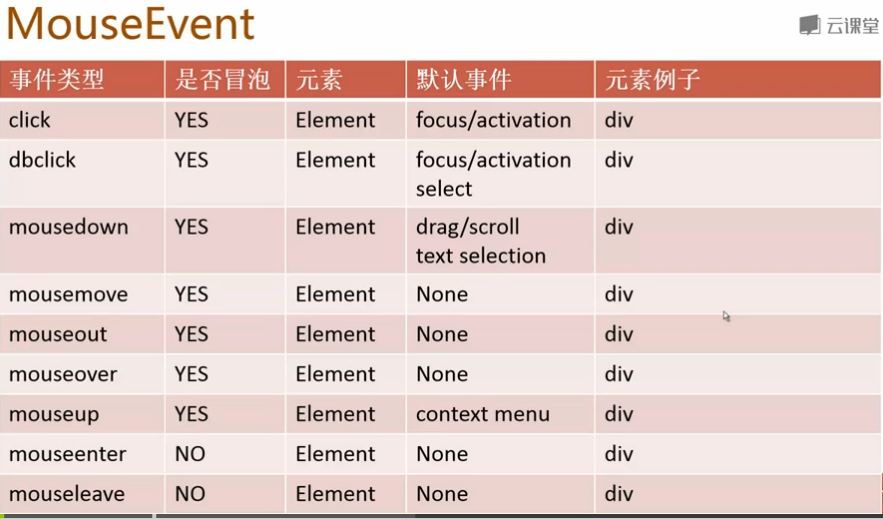
  - 属性
    - clientX, clientY 距离浏览器的距离
    - srceenX, srceenY 距离屏幕的距离
    - ctrlKey, shiftKey, altKey, metaKey
    - button(0,1,2)
  - 顺序
    - 从元素A上方移过
      -mouse`move`->mouse`over`(A)->mouse`enter`(A)->mouse`move`->mouse`out`(A)->mouse`leave`(A)
    - 点击元素
      -mouse`down`->[mouse`move`]->mouse`up`->`click`
    - 栗子：拖拽div  
    HTML
    ```html
    <div id="div1"></div>
    ```
    CSS
    ```css
    #div1 {
      position: absolute;
      top: 0;
      left: 0;
      border: 1px solid #000;
      width: 100px;
      height: 100px;
    }
    ```
    JS
    ```js
    var elem = document.getElementById('div1');
    var clientX, clientY, moving;
    var mouseDownHandler = function (event) {
    }
    var mouseMoveHandler = function (event) {
    }
    var mouseUpHandler = function (event) {
    }
    addEvent(elem, 'mousedown', mouseDownHandler);
    addEvent(elem, 'mousemove', mouseDownHandler);
    addEvent(elem, 'mouseup', mouseDownHandler);
    ```
- 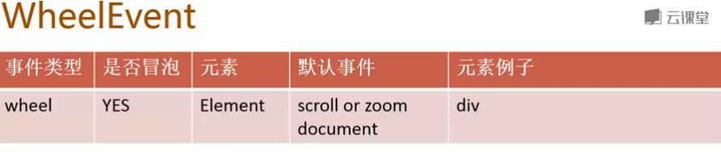
  - 属性
    - deltaMode
    - deltaX
    - deltaY
    - deltaZ
- 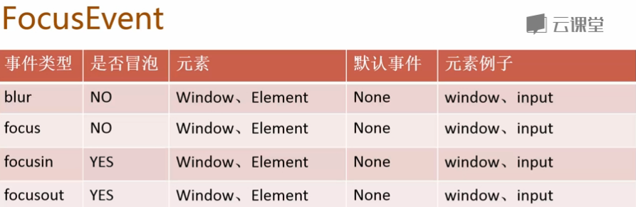
  - 属性
    - relatedTarget
- 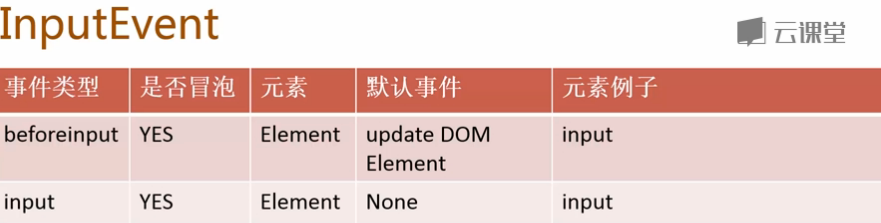
  - onpropertychange(IE)
- 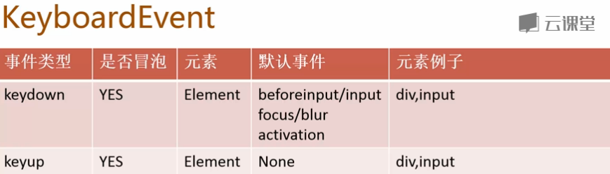
  - 属性
    - key 按下了什么键
    - code
    - ctrlKey, shiftKey, altKey, metaKey
    - repeat
    - keyCode
    - charCode
    - which
- 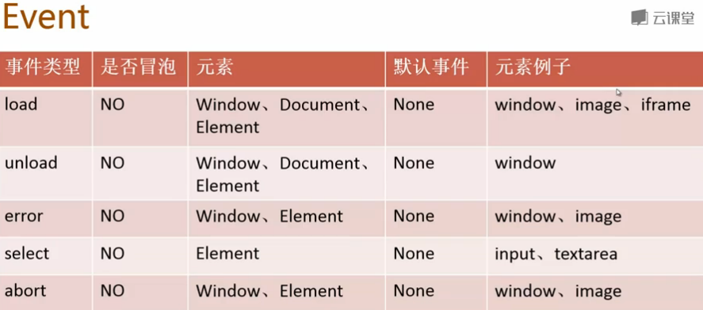
  - window
    - load
    - unload
    - error
    - abort
  - Image
    - load
    - error
    ```html
    
    ```
    - abort
- 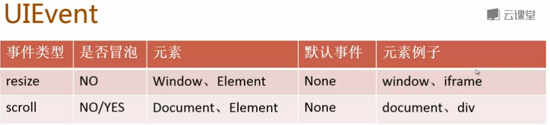
## 事件代理
- 将事件注册到元素的父节点上

## HTTP事务
## 请求报文格式
- 请求报文
  - 头行
    - http的方法
      - GET
      - POST
    - 主机地址
      - baidu.com
    - http的版本
      - http/1.1
  - 头部
    - Accept(接收的类型)
      - Accept: text/html,application/xhtml+xml,application.xml;q=0.9,image/webp,*/*;q=0.8
    - Accept-Encoding(接收类型编码方式)
      - Accept-Encoding:gzip,deflate,sdch
    - Accept-Language(浏览器端可以接收的类型)
      - Accept-Language:en-US,en;q=0.8,zh-CN;
    - Cache-Control(缓存的策略)
      - Cache-Control: no-cache
    - Connection()
      - Connection: keep-alive
    - Cookie() 
      - Cookie: visited=true;playlist=6523423DNT:1
    - Host()
      - Host: baidu.com
    - Pragma()
      - Pragma: no-cache
    - User-Agent(当前浏览器的版本) 
      - User-Agent: Mozilla/5.0(Windows NT 6.1; WOW64) AppleWebKit/537.36(KHTML, like Geoko) Chrome/41.0.2272.118 Safari/537.36
  - 主体
- 响应报文
 - 头行
   - http版本
   - 状态码
   - 状态码描述
   - HTTP/1.1 200 OK
 - 头部
   - Expires(缓存的时间)
     - Expires:Thu, 01 Jan 1970 00:00:00 GMT
   - server(服务器)
     - server: nginx
 - 主体
   - html文件

## 常用HTTP方法
- 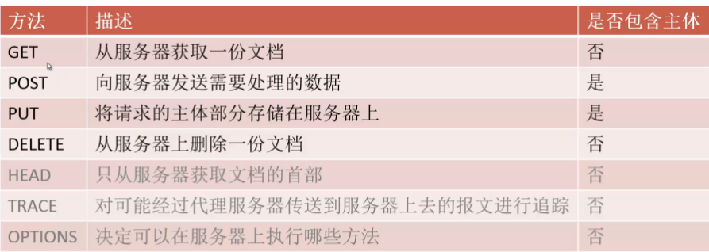

## URL构成
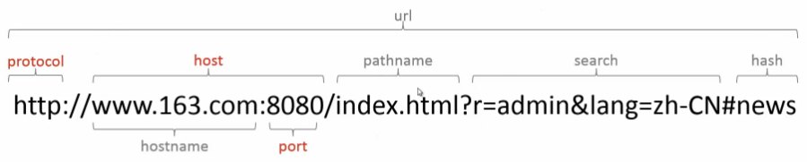

## HTTP版本
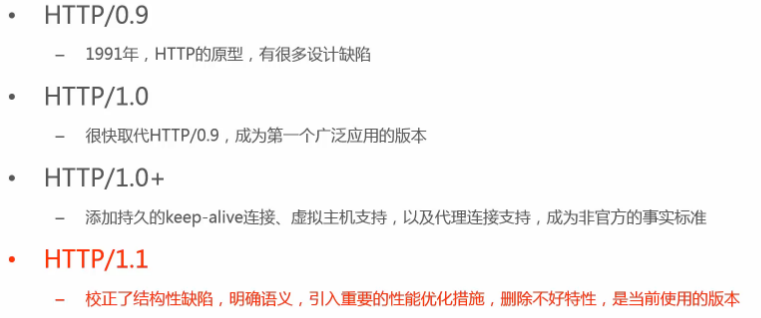

## 常见的HTTP状态码
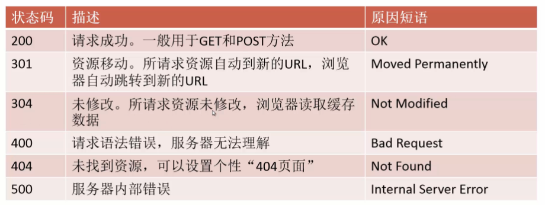

## ajax 
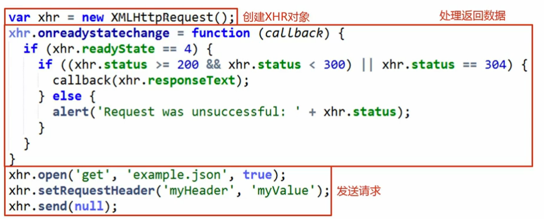
- open
  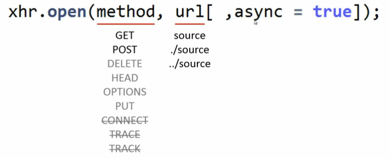
- setRequestHeader
  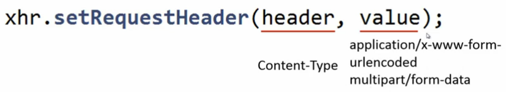
- send
  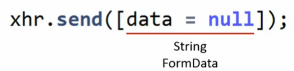
  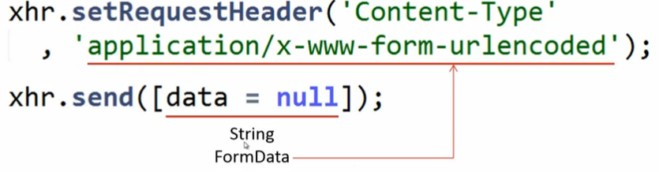
- 同源策略
  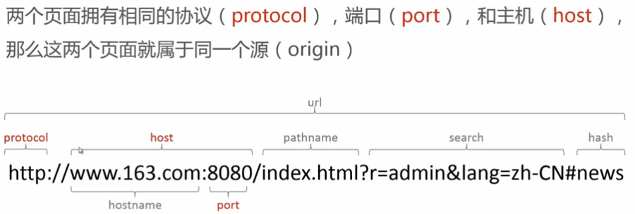
- 跨域资源访问
  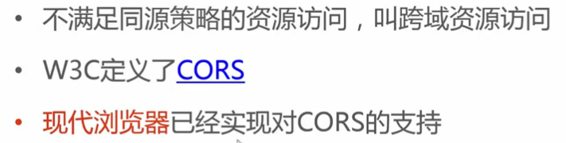
- Ajax请求GET方法的封装
```js
/*
* Ajax异步请求GET方法封装
* @param   url     {String}    请求资源的url
* @param   options     {Object}    请求的查询参数
* @param   callback    {Function}  请求的回调函数，
*            接受XMLHttpRequest对象的reponseText属性作为参数
* @return  void        {}      无返回值
*/
function get(url,options,callback) {
    var xhr = new XMLHttpRequest();     //创建新XHR请求
    xhr.onreadystatechange =function (callback){  //定义事件监听
        //如果请求完成且成功
        if(xhr.readyState == 4) {
            if((xhr.status >=200 && xhr.status <300)||xhr.status == 304) {
                callback(xhr.responseText);
            } else {
              alert('Request was unsuccessful: ' + xhr.status); 
            }
        }
    }
    xhr.open("GET", url+ "?" +serialize(options), true);    //异步GET请求
    xhr.send(null);     //发送请求
}
 
/*
* 编码函数，将查询参数对象序列化
* @param  options     {Object}   查询参数对象
* @return              {String}    查询字符串
 */
 
function serialize(options){
    if(!options) return "" ; //一直返回字符串
    var pairs = [];              //保存键值对
    for(var name in options) {  //遍历参数对象
        if(!options.hasOwnProperty(name)) continue;        //跳过继承属性
        if(typeof options[name] === "function") continue;   //跳过方法
        var value = options[name].toString();            //把值转换为字符串
        name = encodeURIComponent(name);              //编码名字
        value= encodeURIComponent(value);                 //编码值
        pairs.push(name + '=' + value);                 //以“名=值”形式保存
    }
    return pairs.join('&');                                //返回以“&”连接的字符串
}
```
- Ajax请求POST方法的封装
```js
/*
* Ajax异步请求POST方法封装
* @param   url         {String}    请求资源的url
* @param   options     {Object}    请求的查询参数
* @param   callback    {Function}  请求的回调函数，
*            接受XMLHttpRequest对象的reponseText属性作为参数
* @return  void        {}          无返回值
*/
function post(url,options,callback) {
    var xhr = new XMLHttpRequest();     //创建新XHR请求
    xhr.onreadystatechange =function (callback){  //定义事件监听
        //如果请求完成且成功
        if(xhr.readyState == 4) {
            if((xhr.status >=200 && xhr.status <300)||xhr.status == 304) {
                callback(xhr.responseText);
            } else {
              alert('Request was unsuccessful: ' + xhr.status); 
            }
        }
    }
    xhr.open("POST", url, true);  //异步POST请求
    xhr.setRequestHeader("Content-Type",   //设置Content-Type
        "application/x-www-form-urlencoded")
    xhr.send(serialize(options));   //发送请求
 
/*
* 编码函数，将查询参数对象序列化
* @param  options     {Object}   查询参数对象
* @return              {String}    查询字符串
 */
 
function serialize(options){
    if(!options) return "" ; //一直返回字符串
    var pairs = [];              //保存键值对
    for(var name in options) {  //遍历参数对象
        if(!options.hasOwnProperty(name)) continue;        //跳过继承属性
        if(typeof options[name] === "function") continue;   //跳过方法
        var value = options[name].toString();            //把值转换为字符串
        name = encodeURIComponent(name);              //编码名字
        value= encodeURIComponent(value);                 //编码值
        pairs.push(name + '=' + value);                 //以“名=值”形式保存
    }
    return pairs.join('&');                                //返回以“&”连接的字符串
}
```
- [frame代理](https://github.com/genify/nej/blob/master/doc/AJAX.md)

## cookie
- 小型文本文件
- 4k
- 服务端设置
- 属性
  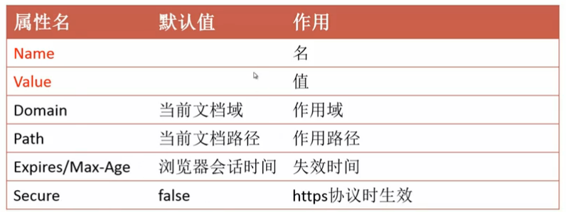
- 缺陷
  - 流量代价
  - 安全性问题
    - 如果cookie被人拦截了，那人就可以取得所有的session信息。即使加密也与事无补，因为拦截者并不需要知道cookie的意义，他只要原样转发cookie就可以达到目的了。
  - 大小限制
- setCookie
```js
function setCookie (name, value, expires, path, domain, secure) {
    var cookie = encodeURIComponent(name) + '=' + encodeURIComponent(value);
    if (expires)
        cookie += '; expires=' + expires.toGMTString();
    if (path)
        cookie += '; path=' + path;
    if (domain)
        cookie += '; domain=' + domain;
    if (secure)
        cookie += '; secure=' + secure;
    document.cookie = cookie;
}
```
- getcookie
```js
function getcookie () {
    var cookie = {};
    var all = document.cookie;
    if (all === '')
        return cookie;
    var list = all.split('; ');
    for (var i = 0; i < list.length; i++) {
        var item = list[i];
        var p = item.indexOf('=');
        var name = item.substring(0, p);
        name = decodeURIComponent(name);
        var value = item.substring(p + 1);
        value = decodeURIComponent(value);
        cookie[name] = value;
    }
    return cookie;
}
```
- removeCookie
```js
function removeCookie (name, path, domain) {
    document.cookie = name + '='
    + '; path=' + path
    + '; domain=' + domain
    + '; max-age=0';
}
```

## Storage
- localStorage
  - 不删除，一直存在
- sessionStorage
  - 浏览器的会话时间
- 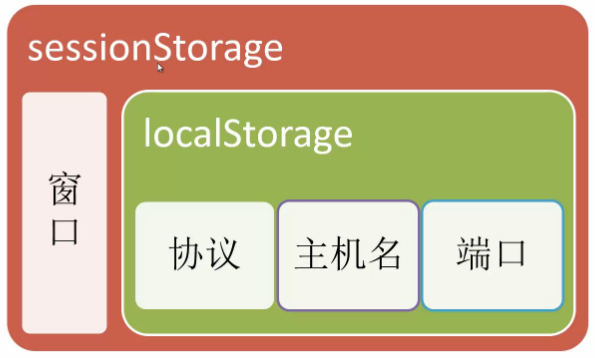
- 大小限制 ： 5MB
- JS对象
  - 读取
    - localStorage.name
  - 添加/修改
    - localStorage.name = 'SSS' // 只支持String类型
  - 删除
    - delete localStorage.name
- API
  - 获取键值对数量
    - localStorage.length
  - 读取
    - localStorage.getItem("name")
    - localStorage.key(i)
  - 添加/修改
    - localStorage.setItem("name", "sss")
  - 删除对应键值
    - localStorage.removeItem("name")
  - 删除所有数据
    - localStorage.clear()

## setInterval
```js
var intervalID = setInterval(func, delay);
clearInterval(intervalID);
```
## setTimeOut
```js
var timeoutID = setInterval(func, delay);  // delay 默认为0 
clearTimeout(timeoutID);
```

## requestAnimationFrame
```js
var requestID = requestAnimationFrame(func)
cancalAnimationFrame(requestID)
// 时间由显示器的刷新时间决定
```

## 常见动画
- 形变
- 位移
- 旋转
- 透明度
- ...


## audio
```html
<audio src="music.mp3"></audio> 
```
- 兼容写法
```html
<audio>

</audio>
```
## video
 ```html
 <video src="movie.mov" width=320 height=240></video>
 ```


## end
