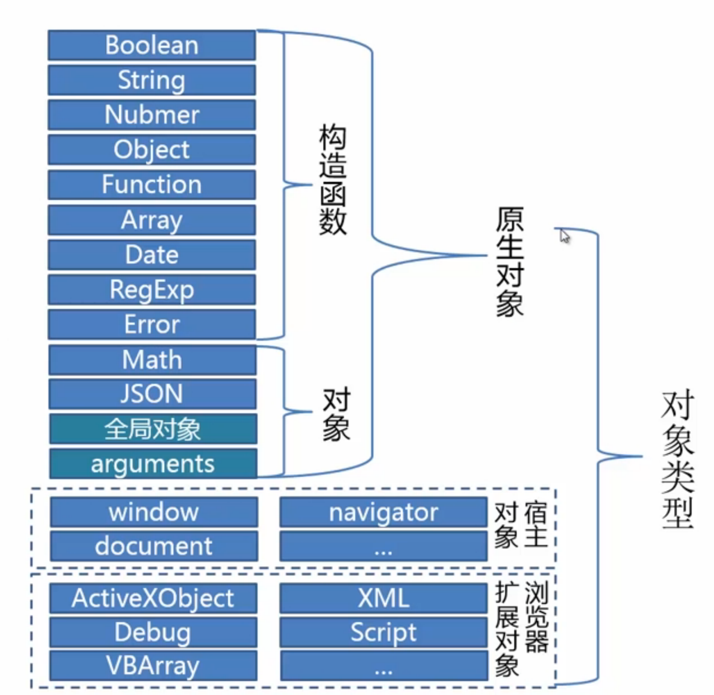
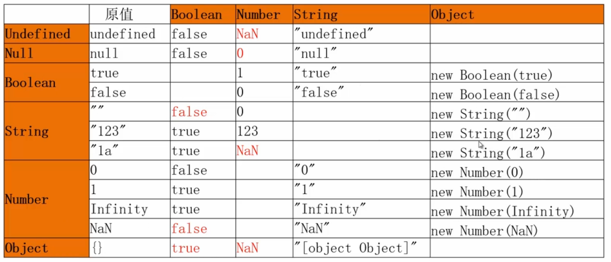

## 类型
- Undefined
- Null
- Boolean
- String
- Number
- Object  
  ```js
	var obj = {};
	var arr = [];
	var date = new Date();
	```
	- 对象类型
	
	- 如何复制一个对象？
	- 隐式类型转换
	  1. 数字运算符
		2. .
		3. if语句
		4. ==
  - 隐式类型转换结果
	  
- Undefined、Null、Boolean、String、Number 为原始（值）类型，直接量定义的自变量为原始类型。

## 类型识别
- typeof  
  可以识别标准类型(Null除外)  
	不能识别具体的对象类型(Function除外)
- instanceof  
	```js
	// 能够判别内置对象类型  
	[] instanceof Array;	// true
	/\d/ instanceof RegExp;	//true
	// 不能判别原始类型  
	1 instanceof Number;	// false
	"jerry" instanceof String	// false
	// 能够判别自定义对象类型
	```
- Object.prototype.toString.call
	```js
	function type(obj) {
		return Object.prototype.toString.call(obj).slice(8, -1);
	}
	type(1)	// "Number"
	type("abc")	// "String"
	type(true)	// "Boolean"
	type(function() {}) // "Function"
	```
	- 识别标准类型以及内置(build-in)对象类型
	- 不能识别自定义对象类型

- constructor  
  - 判断原始类型
	```js
	// 判断原始类型
	"jerry".constructor === String		// true
	(1).constructor === Number				// true
	true.constructor === Boolean			// true
	({}).constructor === Object				// true
	// 判断内置对象类型
	new Date().constructor === Date		// true
	[].constructor === Array					// true
	// 判断自定义对象
	function Persion(name) {
		this.name = name;
	}
	new Persion("jerry").constructor === Person 
	```
	 - 判别标准类型（Undefined/Null除外）
	 - 判断内置对象类型
	 - 判别自定义对象类型
  - 封装方法
	```js
	function getConstructorName(obj){
    return (obj===undefined || obj===null) ? obj : (obj.constructor&&obj.constructor.toString().match(/function\s*([^(]*)/)[1]);
	}
	```
## 函数定义
- 函数声明
- 函数表达式
- 函数实例化  
  定义的函数只能访问本地作用域和全局作用域

## 函数调用
- 函数调用模式 add(1);  
  this 指向全局对象
- 方法调用模式 obj.add(2);  
  this 指向方法调用者
- 构造函数调用模式 new Function(...);  
  this 指向被构造的对象
- Function.prototype.apply的使用  
  this 指向第一个参数
  函数借用，函数冒充
	```js
	function Point (x, y)  {
		this.x = x;
		this.y = y;
	}
	Point.prototype.move = function (x, y) {
		this.x = x;
		this.y = y;
	}
	var p = new Point(0, 0);
	p.move(2, 2);
	var circle = {x:1, y:1, r:1};
	p.move.apply(circle, [2, 1]);	// {x: 3, y:2, z:1}
	```

## 闭包
- 保存函数的执行状态
```js
/**
 * 闭包使用举例1
 * 将字符串中的一些特定字符按顺序用数组中的元素替换，例如：
 * var arr = ['c','f','h','o'];
 * var str = 'ab4de8g4ijklmn7';
 * 替换后 str == 'abcdefghijklmno';
 * replace的用法请参考https://developer.mozilla.org/zh-CN/docs/Web/JavaScript/Reference/Global_Objects/String/replace
**/
var arr = ['c','f','h','o'];
var str = 'ab4de8g4ijklmn1';
console.log(str);
 
var func = (function(){
  // count变量会保存在闭包作用域内，表示func被调用次数（即正在替换第几个字符）
  var count = 0; 
  return function(){
    return arr[count++]; 
  }
})();
 
str = str.replace(/\d/g, func)
console.log(str);
```
- 封装
```js
/**
闭包使用举例2 -- 封装
1.暴露type类型和start, stop, getStatus方法
2.隐藏status，light对象状态
**/
var Car = function(type){
  var status = "stop",
      light = "off";
  return {
    type: type,
    start: function(){
      status = "driving";
      light = "on";
    },
    stop: function(){
      status = "stop";
      light = "off";
    },
    getStatus: function(){
      console.log(type + " is " + status + " with light " + light);
    }
    }
}
 
var audi = new Car("audi");
audi.start();
audi.getStatus();
audi.stop();
audi.getStatus();
```
- 性能优化
```js
/**
闭包使用举例3 -- 性能优化1
减少函数定义时间和内存消耗
**/
// 不使用闭包
function sum(i, j) {
  var add = function(i, j){
    return i+j;
  }
  return add(i, j)
}
var startTime = new Date();
for(var i = 0; i< 1000000; i++) {
  sum(1,1);
}
var endTime = new Date();
console.log(endTime - startTime);
 
// 使用闭包
var sum = (function() {
  var add = function(i, j){
    return i+j;
  }
  return function(i,j) {
    add(i, j);
  }
})()
var startTime = new Date();
for(var i = 0; i< 1000000; i++) {
  sum(1,1);
}
var endTime = new Date();
console.log(endTime - startTime);
```
```js
/**
闭包使用举例3 -- 性能优化2
普通递归函数跟使用闭包记录调用返回结果的递归函数调用次数对比
**/
// 普通递归函数
var factorial = (function(){
  var count = 0;
  var fac = function(i){
    count++;
    if (i==0) {
      console.log('调用次数：' + count); 
      return 1;
    }
    return i*factorial(i-1);
  }
  return fac;
})();
for(var i=0;i<=10;i++){
  console.log(factorial(i)); 
}
 
// 使用闭包记录调用返回结果的递归函数 -- 记忆函数
var factorial = (function(){
  var memo = [1];
  var count = 0;
  var fac = function(i){
    count++;
    var result = memo[i];
    if(typeof result === 'number'){
      console.log('调用次数：' + count); 
      return result;
    } 
    result = i*fac(i-1);
    memo[i] = result;
    return result;
  }
  return fac;
})();
for(var i=0;i<=10;i++){
  console.log(factorial(i)); 
}
```

## bind
```js
function Point(x, y){
    this.x = x;
    this.y = y;
}
Point.prototype.move = function(x, y) {
    this.x += x;
    this.y += y;
}
var p = new Point(0,0);
var circle = {x:1, y:1, r:1};
var circleMove = p.move.bind(circle, 2, 1);
circleMove();
```
## 柯里化
```js
/*
1. 函数柯里化通常是指把接受多个参数的函数变换成接受一个单一参数（最初函数的第一个参数）的并且返回一个接受余下的参数而且返回结果的新函数的技术。
*/
// // 1. 最简单的柯里化
// // sum函数接受三个参数，并返回求和结果
// var sum = function(a,b,c) {
//     return a+b+c;
// }
// // // 最简单柯里化的sum函数
// var sum_curry = function(a){
//     return function(b,c){
//         return a+b+c;
//     }
// }
// /*
 
/*
2. 更泛化的定义是指给函数分步传递参数，每次函数接受部分参数后应用这些参数，并返回一个函数接受剩下的参数，这中间可嵌套多层这样的接受部分参数的函数，直至返回最后结果。归纳一下就是逐步传参，逐步缩小函数的适用范围，逐步求解的过程。
*/
// // 2. 泛化的柯里化
// // currying实现将一个函数转变为柯里化函数
// var currying = function (fn) {
//    var _args = [];
//    return function () {
//     if (arguments.length === 0) {
//       // 实现最终的计算
//       return fn.apply(this, _args); 
//     }
//     // 这里只是简单的将参数缓存起来（用于解释柯里化概念，并非实际应用场景）
//     Array.prototype.push.apply(_args, [].slice.call(arguments)); 
//     return arguments.callee;
//    }
// };
// // sum函数接受任意参数，并返回求和结果
// var sum=function () {
//    var total = 0;
//    for (var i = 0, c; c = arguments[i++];) {
//        total += c;
//    }
//    return total;
// };
// // 或得一个泛化柯里化的sum函数
// var sum_curry = currying(sum); 
// sum_curry(1)(2,3);
// sum_curry(4);
// console.log(sum_curry());
```

## 代码执行过程
- 预解析  
  变量 变量声明 函数声明
- 执行

## ECMAScript DOM

## “DOM2级事件” 事件流包括三个阶段：
- 事件捕获 (Document -> html -> body -> div)
- 处于目标阶段 (div)
- 事件冒泡 (div -> body -> html -> Document)

## addEventListener(处理的事件名称, 事件处理程序, 布尔值)
- 布尔值 如果是 true: 表示在捕获阶段调用事件处理程序，false：表示在冒泡阶段调用事件处理程序。
- 所有主流浏览器都支持addEventListener()方法，除了 IE 8 及更早 IE 版本。  
  可以使用 `attachEvent`

```javascript
var x = document.getElementById("myBtn");
if (x.addEventListener)
{
    x.addEventListener("click", myFunction);
} else if (x.attachEvent)
{
    x.attachEvent("onclick", myFunction);
}
function myFunction()
{
    alert("Hello World!");
}
```

## 正则表达式
- regexObj.test(str) 测试正则表达式与制定字符串是否匹配 返回 true or false  
  /12345678/.test('x12345678x');
- 锚点：匹配一个`位置`
  - ^ : 起始位置 `/^http:/` 以 http: 起始的字符串
  - $ : 结尾位置 `/\.jpg$/` 以 .jpg 结尾的字符串
  - \b: 单词边界 `/\bis\b/` demo /\bis\b/.test('that is tom'); // true
- 字符类
  - 匹配一类字符中的`一个`
  - [abc]: a或b或c
  - [0-9]: 一个数字 [^0-9]: 非数字的一个字符
  - [a-z]: 一个字母
  - .    : 任一字符（换行除外）
- 元字符
  - 具有特殊意义的字符
    - ^、$、\b
    - \d : [0-9]  -->   \D : [^\d]
    - \s : 空白符  -->   \S : [^\s]
    - \w : [A-Za-z0-9_] \W : [^\w]
- 量词
  - 出现的次数
    - `{m,n}: m到n次`
    - `* ：{0,} 0到无穷`
    - `? : {0,1} 0到1次`
    - `+ : {1,1} 1到无穷`
    - `{10} 出现10次`
- 转义符  
  需要匹配的字符是元字符
  - `/^http:\/\//`
  - `/@163\.com$/`
- 多选分支
  - `/thi(c|n)k/` === `/thi[cn]k/`
  - `/\.(png|jpg|jpeg|gif)$/`
- 捕获
  - () : 捕获 `/(.+)@(163|126|188)\.com$/`
  - (?:) : 不捕获
  - 使用：
    - $1、$2,...
    - api参数或返回值
- str.match(regexp)
  - 获取匹配的字符串
- str.replace()
  - 替换一个子串
  ```javascript
var str = 'The price of tomato is 5.';
str.replace(/(\d+)/,'$1.00');
  ```
- regexpObj.exec(str)
  - 更强大的检索
    - 更详尽的结果: index
    - 过程的状态：lastIndex


## IE 6/7/8 不支持事件捕获

## domContentLoaded事件早于onload事件


## 关闭浏览器标签或关闭浏览器
- 代码
```javascript
// ie6和7关闭的时候会提示。
window.opener = null;       // 关闭ie6不提示
window.open('', '_self', '');   // 关闭ie7不提示
window.close();   // 关闭操作
```
- firefox 不能关闭  
  在地址栏输入 `about:config`
  找到 `dom.allow_scripts_to_close_windows` 这项并改为true。


## 获取Object对象长度
```
var nums = {
  "a": "1",
  "b": "2",
  "c": "3"
};
var arr = Object.keys(nums);
console.log(arr); //["a", "b", "c"]
console.log(arr.length) // 3
```

## JSON.parse()
- string -> json Object

## JSON.stringify()
- JSON Object -> string

``` javascript
//方法一：
<!–[if lt IE 7]>
<script  type=”text/javascript” src=”./json2.js”></script>
<![endif]–>

//方法二：
if(!window.JSON){
	window.JSON = {
		// JSON格式转换成对象格式
		parse : function (JsonStr) {
			return eval("("+JsonStr+")");
		}
		// 对象格式转换成JSON格式
		stringfy : function (obj) {
			var result = "";
			for(var key in obj){
				// 下面判断都需要将key值(属性名)加上双引号即"\""+key+"\": = “key:”
				//1. 属性值是String类型eg.var obj = {name:"value",...}

				if(typeof obj[key] == "string"){
					result+="\""+key+"\":\""+obj[key]+"\",";
				}
				//2. 属性值是RegEXP正则表达式变为如下形式“key:{}”,
				else if(obj[key] instanceof RegExp){
					result+="\""+key+"\":{},";
				}
				//3. 属性值是undefined或Function类型则忽略
				else if(typeof obj[key]=="undefined" || obj[key] instanceof Function){

				}
				//4. 如果属性值是一个数组 eg. arr:[]
				else if(obj[key] instanceof Array){
					result+="\""+key+"\":[";
					var arr = obj[key];
					//对属性值数组arr遍历：
					for(var item in arr){
						//4.1 如果数组项是string类型 ["string",....]
						if(typeof arr[item] == "string"){
							result += "\"" + arr[item] + "\",";
						}
						//4.2 如果数组项是正则表达式eg. [/[]/,...]，只保留一对空大括号{}
						else if(arr[item] instanceof RegExp){
							result += "{},";
						}
						//4.3 如果数组项是undefined或函数, 则显示null。
						else if(typeof arr[item] == "undefined" || arr[item] instanceof Function){
							result += null +",";
						}
						// 4.5 如果数组项是对象(非正则，非函数，非null)
						else if(arr[item] instanceof Object){
							result += this.stringify(arr[item]) +",";
						}
						//4.6
						else {
							result += arr[item] + ",";
						}
					}
					result = result.slice(0,-1)+"],"
				}
				//5. 如果属性值是对象(非null，非函数，非数组，非正则)
				else if(obj[key] instanceof Object){
					result += "\"" + key + "\":" + this.stringify(obj[key]) + ",";
				}
				//6. 其他情况
				else {
					result += "\"" + key + "\":" + obj[key] + ",";
				}
			}
			//  最后遍历完毕后去除最后一个逗号,两边加{}
			return "{" + result.slice(0,-1) + "}";
		}
	}
}
```

## end
