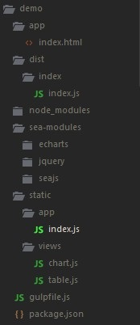

# seajs
- Sea.js 是一个适用于 Web 浏览器端的模块加载器。在 Sea.js 里，一切皆是模块，所有模块协同构建成模块系统。
- seajs遵循的是CMD规范。

## 说明
**对文中提及的点有不赞同的欢迎[提出 issues](https://github.com/kuckboy1994/dailyNote/issues/new)（请添加 `seajs` 标签）讨论。还可提出需要帮助（ `help wanted` 标签）或反馈问题( `bug` 标签)。**

## 目录结构
 
- dist 目录下生成合并压缩后的js代码。
- sea-module 目录下放置的是模块。如jquery、echarts、bootstrap等模块。这些模块往往不需要打包到项目中去。
- static 目录下放置的是需要被打包的js代码。包括入口文件和模块代码（逻辑）。

## 使用
- 在index.html引入seajs。
- 之后配置如下js：

```js
// seajs 的简单配置
seajs.config({
    base: "../sea-modules/",
    alias: {
        "jquery": "jquery/3.2.1/jquery.min.js",
        "echarts": "echarts/3.6.2/echarts.min.js"
    }
});

// 加载入口模块
seajs.use("../static/app/index");
```

- 入口文件如下

```js
define(function(require, exports, module) {
	// 通过 require 引入依赖
	var tableModule = require('../views/table');

	tableModule.init();
	
	// 通过 exports 对外提供接口
	//   exports.doSomething = ...

	// 或者通过 module.exports 提供整个接口
	//   module.exports = ...
});
```

- table.js 文件如下：
  - 还可以调用其他的模块，引入jquery。

```js
define(function(require, exports, module) {
	var $ = require('jquery');
	var chartModule = require('../views/chart.js');

	var table = {
		init: function () {
			console.log('table module -> init');
			var arr = [1,2,3,4];
			$.each(arr, function (key, value) {
				console.log('$.each echo ' + value);
			});
			this.renderTable();
			chartModule.init();
		},
		renderTable: function () {
			console.log('table module -> renderTable');
		}
	};

	module.exports = table;
});
```

- 在使用的时候我们往往需要引入其他现成的模块如： jquery 或 echarts。 但有的时候发现他们不支持 cmd 规范。可以使用如下的方式解决。

```js
define(function(require, exports, module) {
	// jquery 代码
});
```

- 知道上面的内容，你就可以自如的实现项目了，但是作为上线的项目还是不够的，我们还需要对代码进行打包压缩。降低代码的大小和降低代码的可读性。

## 打包
- 我们使用的是gulp。需要三个gulp插件。

```
npm init
// balabala

npm init gulp --save-dev
npm init gulp-cmd-pack --save-dev
npm init gulp-uglify --save-dev
```

- 新建一个gulpfile.js 

```js
var gulp = require('gulp');
var cmdPack = require('gulp-cmd-pack');
var uglify = require('gulp-uglify');
 
gulp.task('cmd', function () {
    gulp.src('static/app/index.js') //main文件 
        .pipe(cmdPack({
            mainId: '../dist/index/index', //初始化模块的id 
            base: "sea-modules/", //base路径
            alias: {
                "jquery": "jquery/3.2.1/jquery.min.js",
                "echarts": "echarts/3.6.2/echarts.min.js"
            },
            ignore: ['echarts', 'jquery'] //这里的模块将不会打包进去 
        }))
        .pipe(uglify())
        // .pipe(uglify({ //压缩文件，这一步是可选的 
        //     mangle: {
        //         except: ['require']
        //     }
        // }))
        .pipe(gulp.dest('dist/index/'));//输出到目录 
});
```

- 命令行运行

```
gulp cmd
```

- 打包常见的问题。
  1. mainId 的值为输出文件的位置，生成完毕后，html中的 seajs.use(**) 也要改成一样的。
  2. base 的路径和html的中的不一定是一样的 base 的路径是相对当前文件的。html中的是相对html中的。所以不一定是一样的。

- 至此应该可以使用了。

## 参考资料
- [seajs官网](https://seajs.github.io/seajs/docs/)
- [介绍一种基于gulp对seajs的模块做合并压缩的方式](http://www.cnblogs.com/lyzg/p/5581961.html)
- [Seajs 简易文档](http://yslove.net/seajs/)
- [gulp-cmd-pack——npmjs](https://www.npmjs.com/package/gulp-cmd-pack)