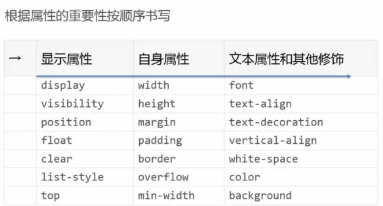
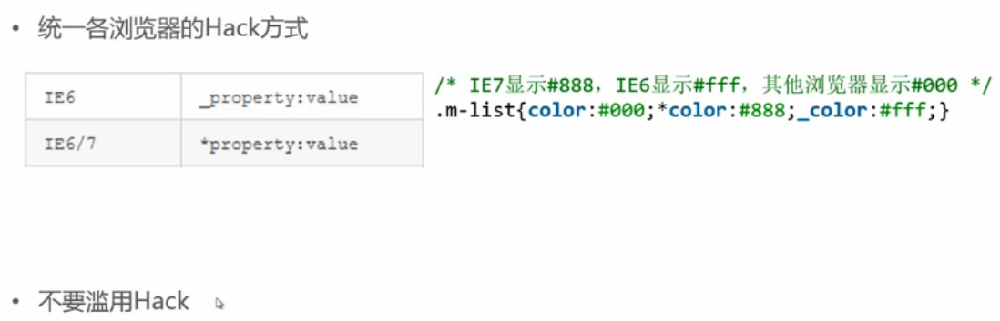

## 规范

## html规范
- 文档声明
	- "<!DOCTYPE html>"，且首行顶格开始
- 闭合
	- 闭合标签: `

`
	- 自闭闭合标签: `<input>` or `<input />`
- 属性
	- `<h1 class="logo"></h1>` or `<h1 class='logo'></h1>`
	- `<input readonly>` or `<input readonly="readonly">`
- 层级
	- 用缩进体现层级，提高可读性
	- 标签正确嵌套，但嵌套不宜过深
	- 两个空格和四个空格
- 注释
- 大小写
	- 标签属性均小写

## css规范
- 
- Hack方式
	
- 值格式
	- color 
		- `white` or `#fff` or `rgb(255,255,255)`
	- url()
		- `icon.png` or `"icon.png"` or `'icon.png'`
## js规范

## 注释规范

## 图片规范
- 文件名称
	- 语意
	- 长度
- 保留源文件
- 图片合并
	- 尽可能使用sprite技术
	- sprite图片可按模块、业务、页面来划分

