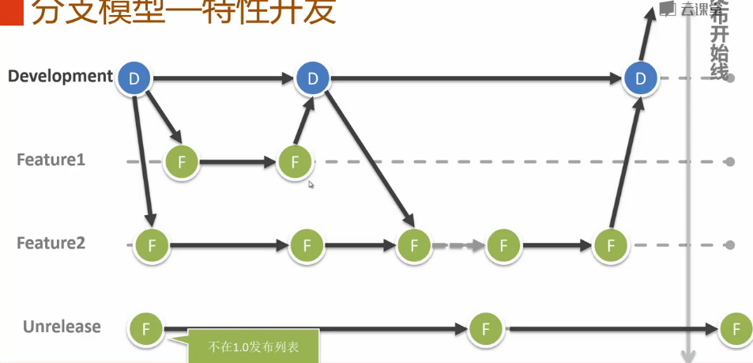
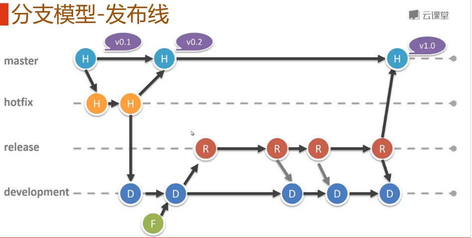
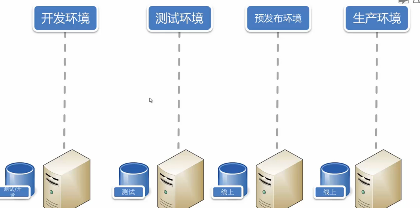

# 分支模型

## 产品级的分支模型
- 常驻分支
    - production(master)
        - 默认分支
    - development
        - 从master创建
- 活动分支
    - feature:
        - 从development创建
    - hotfix: 如hotfix-36
        - 从master创建
    - release: 如release-110
        - 从development创建

## 分支模型——特性开发

## 分支模型——发布线

## 环境

- 开发环境
    - 使用需要提交到下一个release的特性分支
- 测试环境
    - release/development分支
- 预发布环境
    - release 分支
- 生产环境
    - master 分支

