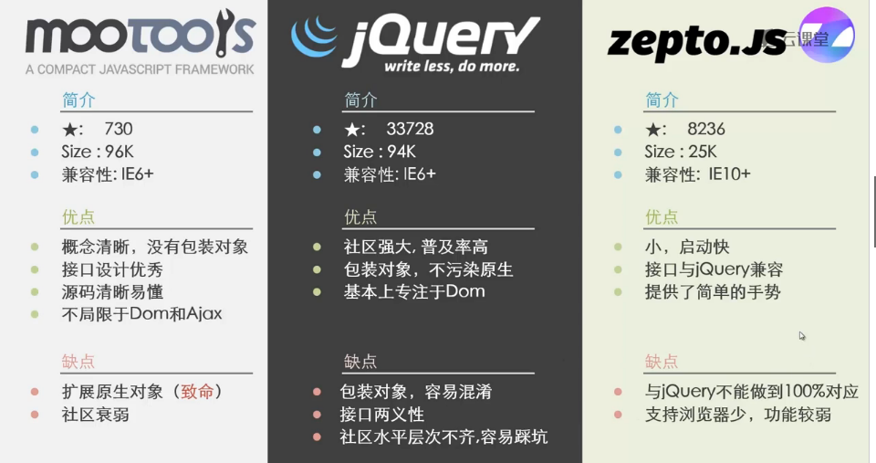
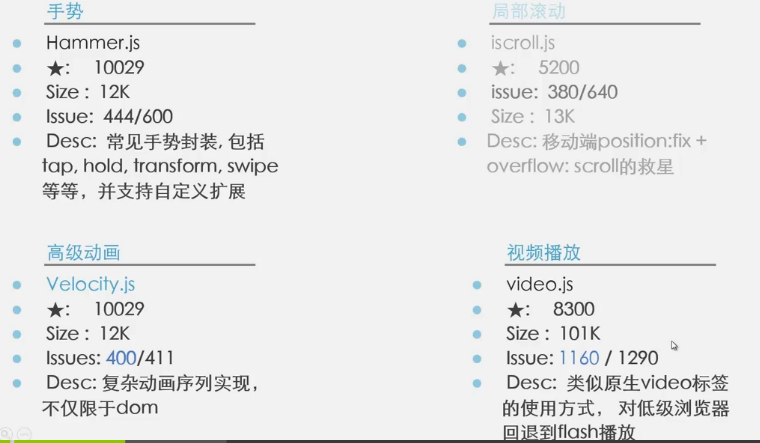
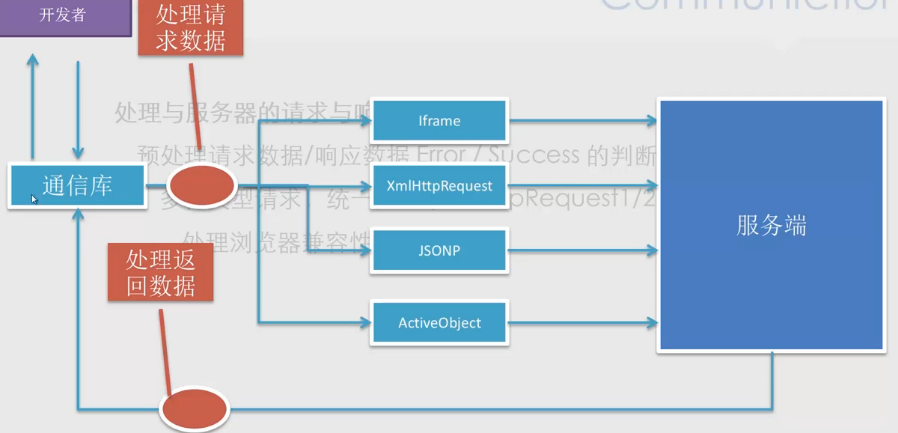
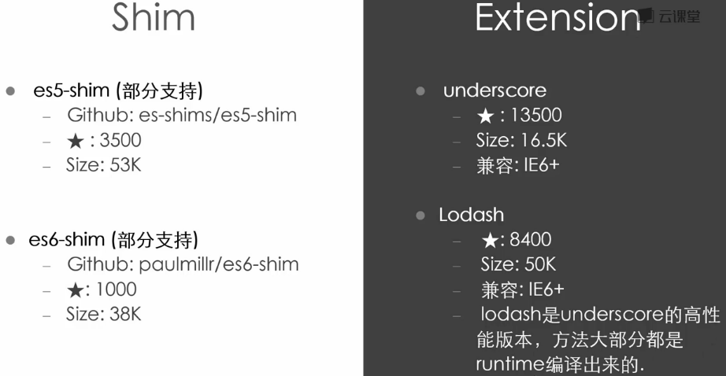
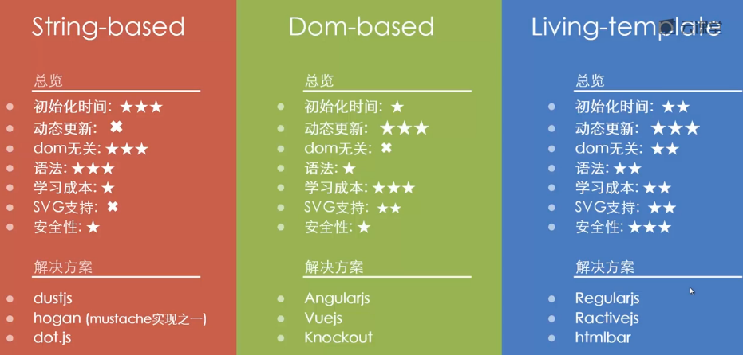
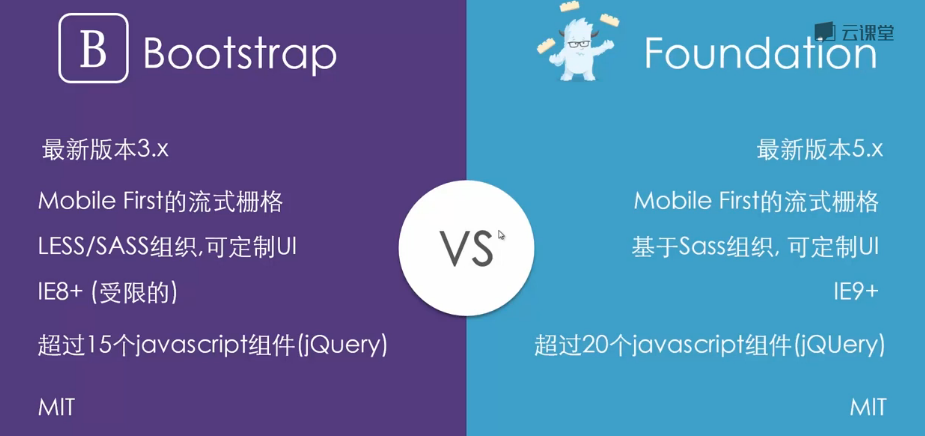
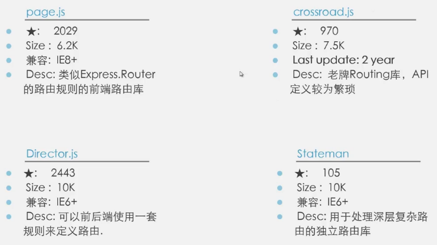
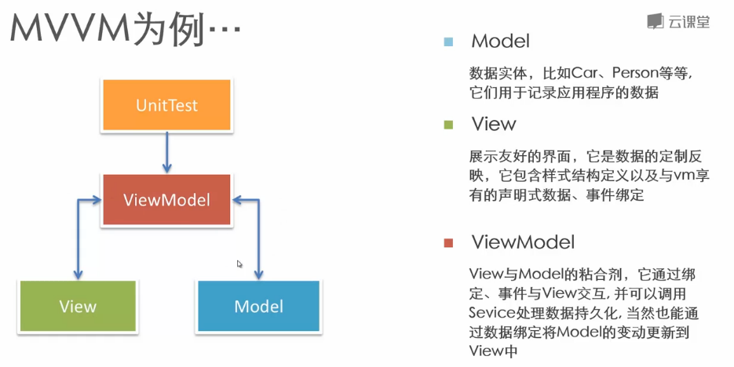
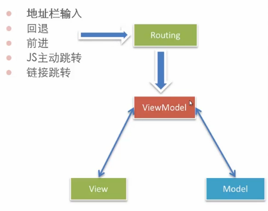

# 解决方案
- 为什么使用解决方案
  - 开发效率
  - 可靠性：浏览器兼容性/测试覆盖
  - 更好的配套：文档/DEMO/工具
  - 设计的更好
  - 专业性

- 不适用解决方案
  - 问题过于简单
  - 备选框架质量与可控性无法保证
  - 无法满足当前业务需求
  - 团队中已有相关积累

## 说明
**对文中提及的点有不赞同的欢迎[提出 issues](https://github.com/kuckboy1994/dailyNote/issues/new)（请添加 `解决方案` 标签）讨论。还可提出需要帮助（ `help wanted` 标签）或反馈问题( `bug` 标签)。**

## DOM
- Selector(选择器)
- Manipulation(dom操作)
- Event(dom)(事件)
- Animation(动画)
### 职责
- 提供便利的dom查询/操作/移动 等操作
- 提供事件绑定/事件代理等支持
- 提供浏览器特性检测，UA侦测
- 提供节点属性、样式、类名等操作
- 所有以上操作实现目标平台的跨浏览器支持
### jQuery zepto.js mootools

### 手势 局部滚动 高级动画 视频播放

## Communication(通信)
- 处理与服务器的请求与相应
- 预处理请求数据/相应数据Error/Success的判断封装
- 多种类型请求，统一接口(xmlHttpRequest1/2,JSONP,Iframe)
- 处理浏览器兼容性

### Request qwest

### socket.io
- 实时性
- 支持二进制数据流
- 智能自动的回退支持（非二进制数据流）
- 多种后端语言支持

## Utility(lang)(函数工具包)
- 提供JS原生不提供的功能
- 方法门面包装，使其更易使用
- 异步队列/流程控制等等

## Templating(模板)
- 字符串模板
- dom模板
- 动态模板

## Component
- 提供基础组件CSS支持
- 提供常用组件如：Slider，Modal
- 提供声明式的调用方式（Optional）

还有其他的非jQuery版本的Bootstrap
- UI Bootstrap
- React Bootstrap

## Routing
- 监听Url变化，并通知注册的模块
- 通过javascript进行主动跳转
- 历史管理
- 对目标浏览器的支持

## Architecture
- MVC、MVVM、MV*
- 提供一种范式帮助（强制）开发者进行模块解耦
- 视图与模型分离
- 更容易进行单元测试
- 更容易实现应用程序的拓展

MVVM

MV* !== SPA(单页系统)(single page application)  
Routing 是 MV* 系统的可定位状态的信息来源

### 为什么统一由路由进行控制？
单页系统的普适法则：`可定位`的应用程序状态都应该统一由路由系统进入，以避免网状的信息流。

[todomv的实现及比较](http://todomvc.com/)

## 参考
- [todomvc](http://todomvc.com/)
- [javascripting](https://www.javascripting.com/)
- [javascriptoo](http://www.javascriptoo.com/)
- [microjs](http://microjs.com/#)